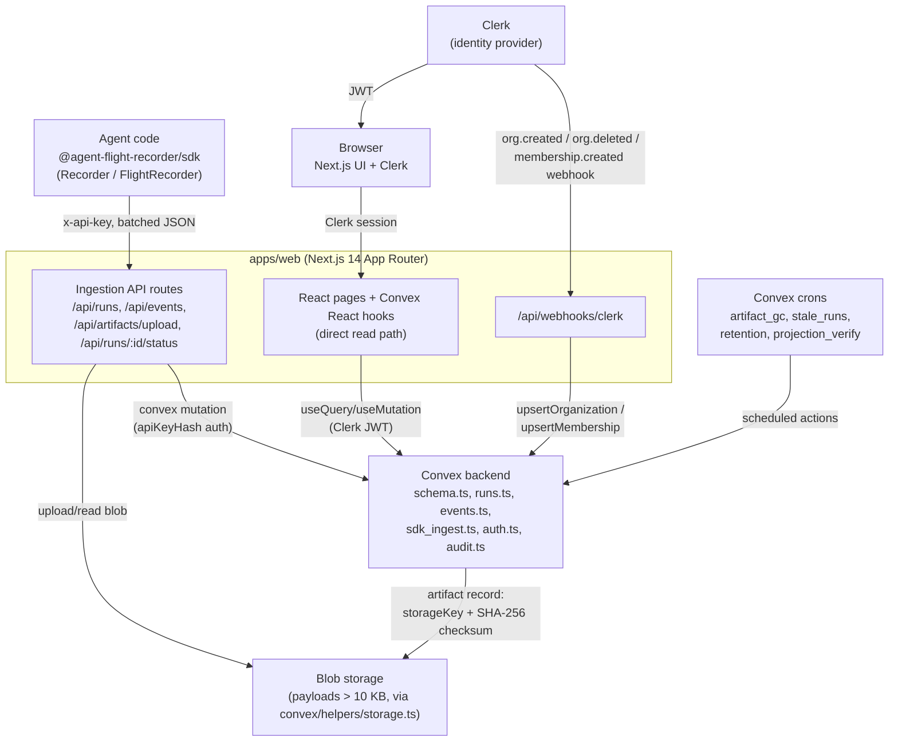

# Architecture — Agent Flight Recorder

This document describes the system as it exists in this repository today. Every claim
below is cited against a file path — if the code changes, update this document in the
same PR (see `CLAUDE.md`).

---

## 1. System Diagram



**Two read/write seams, by design:**

- **SDK -> Next.js API routes -> Convex** — the ingestion surface. Authenticated by
  `x-api-key` (hashed and matched against `convex/api_keys`), never by a Clerk session.
  `convex/sdk_ingest.ts` explicitly does not call `getAuthContext`/`requireOrgMembership`.
- **Browser -> Convex directly** — the UI reads and writes via Convex React hooks using
  the Clerk JWT (`ConvexProviderWithClerk`). Next.js API routes are not a general-purpose
  API for the UI.

---

## 2. Entity Hierarchy

```
Organization
  └── Project
        └── Agent
              └── AgentVersion
                    └── Run
                          └── Event
```

- **Artifact** hangs off **Run** (and optionally a specific **Event**) — a pointer to an
  externalized large payload in blob storage, never the payload itself
  (`convex/schema.ts` `artifacts` table).
- **Comment** hangs off either a **Run** or an **Event** (`targetType: "run" | "event"`)
  — human annotation on recorded data (`convex/schema.ts` `comments` table).
- `AgentVersion` is immutable once created (`convex/schema.ts` `agent_versions` has no
  update mutation path in `convex/agent_versions.ts`); a new version is required for any
  change to an agent's configuration, system prompt, or tool list.
- Every table except `user_memberships`/`api_keys`/`audit_log` carries an `orgId` field
  and is indexed `by_org` (or a composite starting with `orgId`) — see `convex/schema.ts`.

Both `packages/contracts/src/entities.ts` (the shared TypeScript shapes) and
`convex/schema.ts` (the Convex validators) define this hierarchy; per `CLAUDE.md` the
two must stay shape-aligned even though they are separate type systems.

---

## 3. Event Log Invariants

Enforced in two places for defense in depth: the SDK (best-effort, client-side) and
Convex (authoritative, server-side, in `convex/sdk_ingest.ts` `sdkCreateEvents` and the
Clerk-session path `convex/events.ts`).

1. **Append-only, immutable.** `events` table has no update/delete mutation. Comment in
   `convex/schema.ts`: `"IMMUTABILITY: Events must never be updated or deleted."`
2. **Sequence contiguity.** `sequenceNumber` must be a positive integer, monotonically
   increasing per run, starting at 1, with no gaps and no repeats. Server-side check in
   `sdk_ingest.ts` compares against `state.maxSeq + 1` and throws the stable code
   `SEQUENCE_CONFLICT` on mismatch. A duplicate resend of an already-stored
   `(runId, sequenceNumber)` pair is idempotent — it returns the existing event's id
   rather than erroring (this is what makes SDK retries safe).
3. **`run.started` first, a terminal event last.** The first event of a run must be
   `run.started` (`RUN_STARTED_TYPE` check in `sdk_ingest.ts`); once `run.completed` or
   `run.failed` is stored, no further events may be appended (`RUN_NOT_ACTIVE`). A run
   with no terminal event is in-progress (`status: "running"`); storing the terminal
   event also patches the run's `status`/`endedAt` directly, so the run record and the
   event log can never disagree.
4. **10 KB inline payload ceiling.** `MAX_INLINE_PAYLOAD_BYTES = 10 * 1024` in
   `sdk_ingest.ts`. Applied uniformly — there is no type-based exemption for a
   client-claimed `_externalized` payload, precisely so a spoofed `type` field cannot
   smuggle an oversized payload past the guard. Over the limit, the event must be
   replaced with an `ExternalizedPayload` pointer (`packages/contracts/src/events.ts`):
   `{ type: "_externalized", originalType, _artifact: { artifactId, storageKey,
   storageBucket, checksum, size } }`.
5. **Closed event-type set.** `EventType` in `packages/contracts/src/events.ts` is the
   source of truth. It is mirrored (not imported — Convex cannot resolve the contracts
   package path) as `VALID_EVENT_TYPES` in both `convex/events.ts` and
   `convex/sdk_ingest.ts`; both carry a `MUST stay in sync` comment. Adding an event type
   means updating all three plus the SDK's `Events` builders in
   `packages/sdk/src/events.ts` — see `CONTRIBUTING.md`.

---

## 4. Tenancy Model

- **Clerk organization is the tenancy boundary.** Clerk's `org_id` JWT claim maps 1:1 to
  a Convex `organizations` record via the `clerkOrgId` field
  (`organizations.by_clerk_org_id` index).
- **Every Clerk-session query/mutation** calls `getAuthContext(ctx)`
  (`convex/auth.ts`) first, which throws `"Unauthorized"` if there is no identity or no
  `org_id` claim, then resolves the Convex `orgId`. Mutations that need a minimum
  privilege additionally call `requireOrgMembership(ctx, orgId, { minimumRole })`.
- **Role tiers.** `user_memberships.role` is one of `viewer` / `member` / `admin`, ranked
  0/1/2 in `convex/auth.ts` (`ROLE_RANK`). `requireOrgMembership` defaults to
  `minimumRole: "viewer"` and rejects callers ranked below the requested minimum.
- **The SDK ingest path is a separate authorization path entirely** — see Section 5. It
  never calls `getAuthContext`; it resolves and scopes to an org via the API key's
  `orgId` field instead. Every ingest mutation in `sdk_ingest.ts` checks
  `run.orgId !== apiKey.orgId` (or the agent/version equivalent) before touching data —
  this is the cross-org leak guard for the ingest surface.
- **Guarantee:** because every code path resolves an `orgId` before querying, and every
  index/filter includes it, a query for org A can never surface org B's records —
  provided every new query/mutation follows this pattern (`CLAUDE.md` Tenancy Rule 3).

---

## 5. Ingest Paths and the Error-Code Contract

Two distinct ingest paths exist, authenticated differently:

| Path | Auth | Entry point | Convex functions |
|------|------|-------------|-------------------|
| Clerk-session (web UI) | Clerk JWT, `getAuthContext` + `requireOrgMembership` | Convex React hooks called directly from `apps/web` | `convex/runs.ts`, `convex/events.ts`, `convex/comments.ts`, etc. |
| SDK ingest | `x-api-key` header, hashed and matched against `convex/api_keys` | `apps/web/app/api/{runs,events,artifacts,runs/[id]/status}/route.ts` | `convex/sdk_ingest.ts`: `sdkCreateRun`, `sdkCreateEvents`, `sdkCreateArtifact`, `sdkUpdateRunStatus`, `checkIngestAuth` |

Every SDK ingest mutation calls `resolveApiKey` first, which checks existence,
revocation (`revokedAt`), expiration (`expiresAt`), and scope (`scopes` — a key with no
`scopes` array has full ingest access for back-compat), then throttled-stamps
`lastUsedAt`. `resolveApiKey` also enforces the fixed one-minute-window rate limit
(`api_keys.rateLimitPerMin` / `rateWindowStart` / `rateWindowCount`) — approximated for
high-throughput single-unit calls via a Morris-style stride counter
(`RATE_FLUSH_STRIDE = 25`) to avoid serializing every ingest call on one document, exact
for small limits and for batch calls.

### Error-code contract

Convex throws `Error("CODE: human text")` via `afrError()` (`convex/helpers/errors.ts`).
The codes that cross the SDK boundary are the closed set in
`packages/contracts/src/api_errors.ts` (`AFR_API_ERROR_CODES`) — **append-only; a
deployed SDK matches on the exact string, so an existing code must never be renamed or
removed**:

| Code | Meaning | HTTP status (`apiHandler.ts` `AFR_CODE_TO_STATUS`) |
|------|---------|------|
| `RUN_NOT_ACTIVE` | Event append attempted on a terminal/cancelled run | 409 |
| `SEQUENCE_CONFLICT` | Non-contiguous or otherwise invalid `sequenceNumber` | 409 |
| `EVENT_LIMIT_EXCEEDED` | Run hit `MAX_EVENTS_PER_RUN` | 422 |
| `ARTIFACT_LIMIT_EXCEEDED` | Run hit `MAX_ARTIFACTS_PER_RUN` | 422 |
| `COMMENT_LIMIT_EXCEEDED` | Target hit its comment cap | 422 |
| `RATE_LIMITED` | Per-API-key ingest rate limit exceeded | 429 (with `Retry-After: 60`) |

`apps/web/src/lib/apiHandler.ts` (`mapAfrErrorResponse`) parses the `CODE:` prefix out of
the Convex-wrapped error message (Convex re-wraps server errors in its own envelope, so
the parser scans every colon-delimited token, not just the first) and returns a JSON body
`{ code, message, details: { requestId } }` with the mapped status. Unrecognized errors
fall through to the route's own handling (401 for a bad/missing API key) or are rethrown
for `withApiHandler` to log and genericize.

---

## 6. Blob Storage / Payload Externalization

`convex/helpers/storage.ts` defines the storage abstraction Convex-side; the actual
upload for SDK-originated artifacts flows through
`apps/web/app/api/artifacts/upload/route.ts`, backed by Vercel Blob
(`BLOB_STORE_URL`/`BLOB_STORE_TOKEN` in `.env.example`). An artifact record
(`convex/schema.ts` `artifacts` table) stores `storageKey`, `storageBucket`, `size`, and
a SHA-256 `checksum` — never the payload bytes. Artifacts dedupe per `(runId, checksum)`
(`sdk_ingest.ts` `sdkCreateArtifact`), so a retried upload after a failed `/api/events`
call does not create a duplicate blob record.

**GC bookkeeping:** once an event's `_externalized` payload references an artifact, the
event's id is stamped onto `artifacts.referencedByEventId`
(`sdk_ingest.ts` — patching the artifact, never the event, so event-log immutability
holds) so the artifact permanently leaves the daily `artifact_gc` cron's
orphan-candidate scan (`convex/artifact_gc.ts`, scheduled in `convex/crons.ts`).

---

## 7. Durability Story (SDK -> Server)

The buffered `Recorder` (`packages/sdk/src/recorder.ts`) is the durability-hardened path
(the un-buffered `FlightRecorder` in `packages/sdk/src/flight-recorder.ts` sends each
event immediately instead, trading durability for simplicity):

1. **Buffer.** `recordEvent` assigns a local, per-run monotonic `sequenceNumber` and
   pushes the built event onto an in-memory `eventBuffer`. Terminal event types
   (`run.completed`/`run.failed`/`run.cancelled`) are protected from ever being dropped
   on overflow (`PROTECTED_EVENT_TYPES` in `recorder.ts`).
2. **Spool (optional, Node-only).** `FileSpool` (`packages/sdk/src/file-spool.ts`) is an
   append-only JSONL file. Appending resolves once data is handed to the OS page cache
   (survives a process crash, not a kernel panic/power loss unless `{ fsync: true }` is
   set). `Recorder.recover()` uses `peek()` -> send -> `clear()`, in that order, so a
   crash mid-recovery re-sends duplicates (safe — see idempotency below) rather than
   losing entries. The spool has no file locking; it is a single-process-per-path
   primitive by design.
3. **Per-run batching.** `flush()` groups the buffer `groupByRun` and ships each run's
   events together, preserving order within a run. Flushes are chained
   (`flushChain`) so two overlapping flush triggers (the flush timer and the
   max-batch-size trigger) can never reorder the buffer — a reordered flush would fail
   the server's contiguity check and permanently wedge the run.
4. **Server idempotency.** Because `sdk_ingest.ts`'s `sdkCreateEvents` treats a resend of
   an already-stored `(runId, sequenceNumber)` as a no-op returning the existing event
   id (rather than a conflict), retries from an unreliable network or a spool replay are
   always safe to resend — the worst case is redundant network calls, never a duplicate
   or corrupted event.

---

## 8. Scheduled Jobs

All defined in `convex/crons.ts`. Four run daily in UTC; two run every minute
(interval jobs, not time-of-day):

| Schedule (UTC) | Job | Action |
|------------|-----|--------|
| 01:00 daily | `enforce-retention` | `retention:enforceRetention` — deletes terminal runs (and their events/artifacts/comments/verification results) past an org's opt-in `retentionDays` window (ADR 001) |
| 02:00 daily | `artifact-gc` | `artifact_gc:cleanOrphanedArtifacts` — deletes artifacts older than 24h with no referencing event, from both blob storage and Convex |
| 03:00 daily | `expire-stale-runs` | `stale_runs:expireStaleRuns` — transitions runs stuck in `"running"` for >24h to `"timed_out"` |
| 04:30 daily | `verify-projection-integrity` | `projection_verify:verifyRecentRuns` — checks sequence contiguity for up to 50 recent terminal runs, recording a `verification_results` row |
| 05:00 daily | `compute-daily-rollups` | `rollups:computeDailyRollups` (ADR-002) — computes yesterday's per-agent terminal-run counts, duration percentiles, and token totals into `daily_rollups`, after the other daily jobs so it sees post-retention/post-GC state |
| every 1 min | `deliver-pending-webhooks` | `webhook_engine:deliverPendingWebhooks` (ADR-003) — drains due `"pending"` rows in `webhook_deliveries`, in bounded batches (`WEBHOOK_DELIVERY_BATCH_SIZE`) |
| every 1 min | `deliver-pending-emails` | `email_engine:deliverPendingEmails` (ADR-003) — drains due `"pending"` rows in `email_deliveries` (alert-rule email channels) through whichever `EmailNotifier` `convex/helpers/notifier.ts`'s `getConfiguredEmailNotifier()` resolves to (console logger by default; `AFR_EMAIL_PROVIDER=resend` opts into a real send) |

Retention runs before artifact GC deliberately, so GC sees the post-retention state.

**Terminal-event alert/eval scheduling (not a cron — an inline scheduler
call):** the moment a run's terminal event (`run.completed`/`run.failed`) is
stored — in both the Clerk-session path (`convex/events.ts`) and the SDK
ingest path (`convex/sdk_ingest.ts`) — the mutation calls
`ctx.scheduler.runAfter(0, ...)` against a single Convex action,
`alert_engine.runEvalsThenEvaluateAlerts`, that sequences auto-run evals and
then alert-rule evaluation for that run. This runs non-blocking relative to
the event-insert mutation, and is scheduled as **one** action (not two
independent `runAfter(0, ...)` calls) specifically so eval results are
guaranteed to exist before alert evaluation reads them — two independent
scheduler calls would race and could let alert evaluation run before an eval
insert lands, permanently missing the alert for that run. This is what makes
alerting and webhook/email delivery actually live end to end: terminal event
→ scheduled alert evaluation → `alert_events`/`webhook_deliveries`/
`email_deliveries` row → drained by the per-minute crons above. See
`docs/api_reference.md` §3 for the outbound delivery contract this produces.

**Run explanation lifecycle ("Why did this fail?", ADR-004 — also not a
cron, an inline scheduler call):** the same terminal-transition paths that
schedule alert evaluation above also schedule
`ctx.scheduler.runAfter(0, ...)` against `run_explanations:generateRunExplanation`
whenever a run lands in `failed`, `timed_out`, or `cancelled` — the
`run.failed` terminal event (`convex/events.ts`, `convex/sdk_ingest.ts`), an
admin's `updateRunStatus` call, and the `expire-stale-runs` cron above (a run
that cron transitions to `timed_out` gets an explanation scheduled the same
way a directly-failed run does). Generation is non-blocking relative to
whatever mutation/cron scheduled it, and never runs for `completed` or
still-active runs — `getRunExplanation` returns `null` for those rather than
a placeholder.

Each generation:

1. Computes a deterministic `FailureSummary` from the run's own event log
   (`convex/helpers/failure_summary.ts`, a dependency-free mirror of
   `apps/web/src/lib/replay/failure.ts` — Convex cannot import across the
   `apps/web` boundary) plus its evals.
2. ALWAYS computes `buildHeuristicExplanation` (`convex/insights.ts`) first
   — zero-config, deterministic, and the result that ships whenever no LLM
   provider is configured or the LLM path is skipped/discarded.
3. Optionally also calls a configured `ExplanationLLM`
   (`convex/helpers/llm_provider.ts` — `NoopExplanationLLM` by default,
   `HttpExplanationLLM` when `AFR_LLM_PROVIDER=http`) with a grounding prompt
   listing only the run's real `sequenceNumber`s, fenced with an
   `UNTRUSTED_TRACE_DATA` delimiter around every agent/tool-controlled
   string (event excerpts, failure reason/message) — `neutralizeTraceMarkers`
   strips any literal occurrence of the fence markers from that content first
   so trace data can never forge a fake close/reopen of the fence.
4. Validates any LLM result via `validateCitedSeqNums` — citations not
   present in the run's own event window are stripped — and discards the LLM
   result entirely (falling back to the heuristic) unless what remains cites
   at least one real event and has a non-empty summary/root cause. This is
   the unconditional grounding guarantee: no stored explanation, from either
   path, can cite a fabricated event.
5. Stores one row per run in `run_explanations` (delete-then-insert
   regeneration, not append-only — a generated artifact *about* the
   immutable event log, not an observation recorded *into* it) and audits
   every regeneration (`run_explanation.regenerated` in `audit_log`).

`regenerateRunExplanation` (admin-gated action, `POST
/api/runs/[id]/explanation/regenerate`) re-runs this same pipeline
synchronously on demand. See `docs/adr/004-run-explanations.md` and
`docs/design/explanations.md` for the full threat model and HTTP surface.

---

## 9. Sampling and Its Effect on Rollups, Alerts, and Usage Counters

The SDK supports client-side head sampling with tail-bias for failures
(`packages/sdk/src/sampling.ts`, `SamplingConfig`/`decideSampling`): a
sampling decision is made once at `startRun()`, optionally seeded
deterministically from the run name (`seedFromRunName`) or overridden by a
caller-supplied `decider`. An unsampled run's events are never transmitted to
the server at all — unless `alwaysKeepFailures` is set, in which case an
unsampled run that ends via `failRun()` retroactively ships its
shadow-buffered events.

This has a consequence every consumer of server-side aggregates must
understand: **sampling is a client-side, per-SDK-integration configuration
decision that is completely invisible to the server.** Convex has no
knowledge that a run was sampled out — it simply never receives it. This
means:

- **`usage_counters` undercount** actual agent activity whenever any caller
  samples below `rate: 1`. The counters are already documented as
  approximate/observability-grade (ADR-002), but sampling is an additional,
  separate source of undercount on top of the counters' own
  contention-mitigation approximation.
- **`daily_rollups` undercount** the true population of runs for any
  agent/day where a sampled SDK integration is in use — the rollup's
  percentiles and totals are computed only over what actually reached
  Convex, which is a biased-by-tail-inclusion subset when
  `alwaysKeepFailures` is set (failures are over-represented relative to
  their true rate, successes under-represented).
- **`failure_rate` alerts (`convex/alert_engine.ts`) evaluate only over
  sampled-in traffic.** If an org's agents sample at `rate: 0.1`, a
  `failure_rate` alert's computed percentage is over that 10% window, not
  the agent's true failure rate — and with `alwaysKeepFailures` enabled, the
  sampled-in population is deliberately failure-biased, which can make a
  `failure_rate` alert fire more eagerly than the true failure rate
  warrants (or, without `alwaysKeepFailures`, under-fire because failures
  are sampled out at the same rate as successes).
- **An alert admin configuring `failure_rate` thresholds in the web UI has no
  visibility into whether, or at what rate, the org's SDK integrations
  sample** — sampling is set in SDK-side code the alert admin may not
  control or even know about. This is a real operational gap: there is no
  current mechanism (as of this cycle) for the server to distinguish a "10
  failures out of 10 sampled runs" scenario from a true 100% failure rate.

None of this violates the event log's own invariants (the sampled-out
events genuinely never existed server-side, which is different from the log
being incomplete for events that were ingested) — but it does mean every
rollup/usage/alert consumer must treat these aggregates as **"over whatever
reached the server,"** not as ground truth about agent behavior.

---

## 10. Search-Index Gap for Externalized Error Payloads

`runs.searchText` (the field behind the `search_runs` search index,
ADR-002) is appended to at terminal reconcile when a `run.failed` event
lands, via `extractErrorMessage(evt.payload)`
(`convex/helpers/run_fields.ts`, called from both `convex/events.ts` and
`convex/sdk_ingest.ts`). This extraction reads `payload.message` /
`payload.errorMessage` / `payload.error.message` directly off the **event's
stored payload as received**.

When a `run.failed` payload exceeds the 10 KB inline ceiling (Event Log Rule
3), the stored payload is not the original error object — it is the
`_externalized` pointer shape (`{ type: "_externalized", originalType,
_artifact: { artifactId, storageKey, storageBucket, checksum, size } }`,
`packages/contracts/src/events.ts`). `extractErrorMessage` runs against this
pointer object, which has none of `message`/`errorMessage`/`error.message`,
so it returns `undefined` and `runs.searchText` is **not** updated with any
error text for that run.

**Practical effect:** a run that fails with a large error payload (a long
stack trace, a big tool-output dump) is *less* discoverable via
`searchRuns`/`GET /api/v1/runs` full-text search than a run with a small
error message, purely because of payload size — the opposite of what an
engineer debugging a bad failure would want. This is a known gap, not yet
addressed: closing it would require either fetching the externalized
artifact's content at terminal-reconcile time (an extra blob read on every
large-payload failure) or truncating/summarizing the original error message
into `searchText` *before* externalization decides to externalize the full
payload (i.e. computing a short excerpt earlier in the ingest pipeline, independent
of the size check). Neither is implemented as of this cycle.

---

## 11. Where This Document Can Go Stale

This file describes source-of-truth code paths, not aspirations. When any of the
following change, update this document in the same PR: `convex/schema.ts`,
`convex/sdk_ingest.ts`, `convex/auth.ts`, `convex/crons.ts`,
`convex/alert_engine.ts`, `convex/webhook_engine.ts`, `convex/email_engine.ts`,
`packages/contracts/src/{entities,events,api_errors}.ts`,
`packages/sdk/src/{recorder,flight-recorder,file-spool,sampling}.ts`,
`apps/web/src/lib/apiHandler.ts`.
